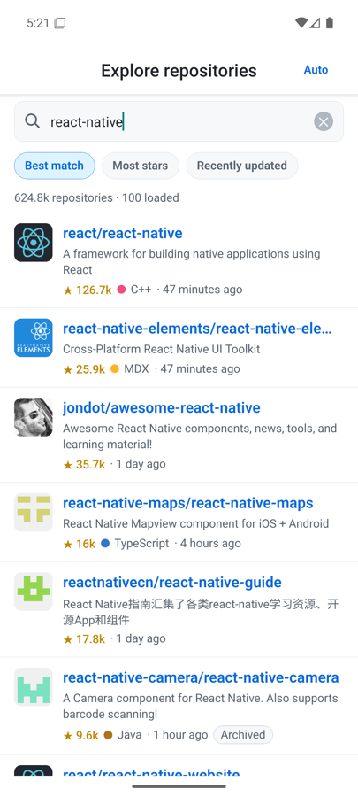
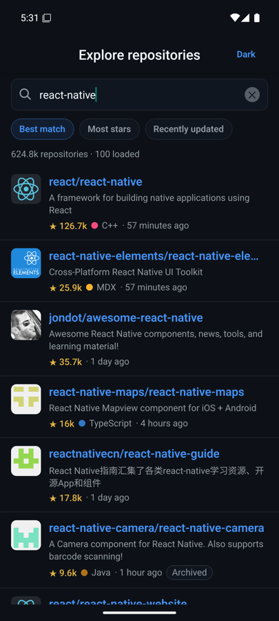
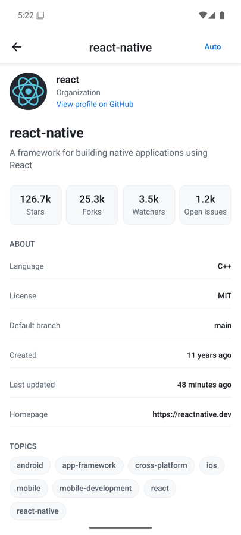
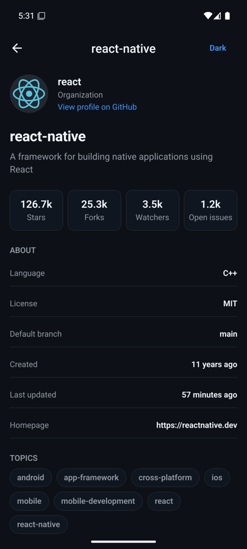
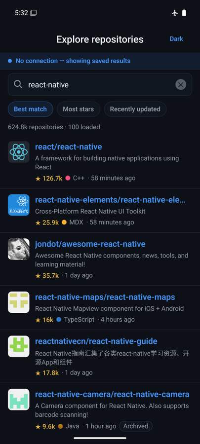
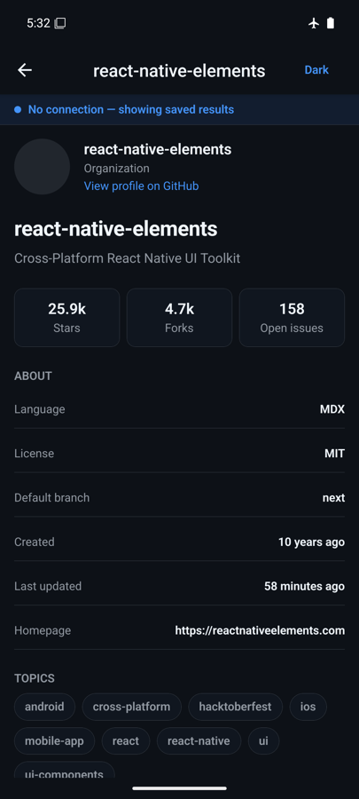
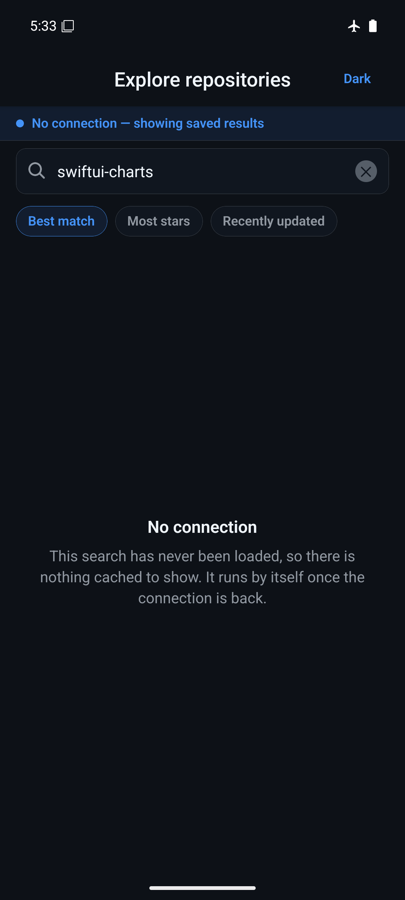

# GitHub Repos Explorer

A cross-platform React Native app for searching public GitHub repositories, browsing results in a
virtualized list, and inspecting a repository in detail. Built with bare React Native 0.87 (New
Architecture + Hermes) and TypeScript in strict mode.

| Search (light)                                     | Search (dark)                                    | Detail (light)                                     | Detail (dark)                                    |
| -------------------------------------------------- | ------------------------------------------------ | -------------------------------------------------- | ------------------------------------------------ |
|  |  |  |  |

| Offline cold start (cache restored)                  | Offline detail (served from cache)                     | Offline, never-loaded search                                   |
| ---------------------------------------------------- | ------------------------------------------------------ | -------------------------------------------------------------- |
|  |  |  |

Screenshots are from the Android release build; the same code runs on iOS.

---

## Features

- Debounced keyword search against the GitHub Search API
- Virtualized result list with avatar, full name, description, stars, language and last-updated time
- Infinite scroll (100 results per request, up to the 1 000-result API ceiling)
- Detail screen with owner info, stats grid, license, branch, topics and deep links to GitHub
- Sort by best match / most stars / recently updated
- Dark mode with an in-app Auto / Light / Dark switch in the header; Auto follows the device and an
  explicit choice overrides it, persisted across restarts
- Offline support: the query cache and the last search term survive an app restart with no network,
  and a cached repository still opens its detail screen behind a stale-data notice
- Connectivity awareness: a banner reports that requests are paused while the device is offline, and
  queries refetch by themselves the moment the connection returns
- Failures that do not empty the screen are reported beside the data: a failed refresh or a failed
  next page keeps the list and offers its own retry
- Typed error taxonomy with distinct copy for rate limiting, offline, 404, 422 and 5xx
- Pull-to-refresh, skeleton loading state, empty states, error boundary

---

## Setup

Requires Node >= 22.11, Yarn 1.x, JDK 17, Android SDK and (for iOS) Xcode 16.1+ with CocoaPods.

```bash
yarn install
```

**Android**

```bash
yarn android
```

**iOS**

```bash
yarn pods && yarn ios
```

**Other scripts**

```bash
yarn typecheck     # tsc --noEmit
yarn lint          # eslint, zero warnings tolerated
yarn format:check  # prettier, the same check CI runs
yarn format        # prettier --write
yarn test          # jest
yarn apk           # release APK -> android/app/build/outputs/apk/release/
```

All four checks run on every push and pull request via `.github/workflows/ci.yml`.

### Rate limits

The app calls the GitHub API unauthenticated, which allows **10 search requests per minute** and
**60 core requests per hour**. That is the main reason searches are debounced and results are
cached aggressively. `createGitHubClient(token)` already accepts a personal access token; wiring it
to a build-time secret would lift the limit to 30/min and 5 000/hour.

---

## APK

A release APK is built with `yarn apk` and lands in
`android/app/build/outputs/apk/release/app-release.apk`.

- Universal APK, all four ABIs: **61.1 MB**
- Minified and resource-shrunk with R8 (`minifyEnabled` / `shrinkResources` are on for release)
- Signed with the debug keystore, which is deliberate for a demo artifact — a real release would
  use a private keystore and ship an AAB (`./gradlew bundleRelease`) so Play delivers roughly
  20 MB per device instead of a universal binary

---

## Architecture

The project follows **Feature-Sliced Design v2.1**, deliberately using only the three layers the
app has earned. FSD's own guidance is "start simple, extract when needed" and warns against
speculative `entities/` and `features/` slices; a two-screen client does not need them.

One deliberate deviation: FSD names the route-level layer `pages`. Here it is `screens`, because
that is the vocabulary React Native and React Navigation already use. The layer's responsibilities
and import rules are unchanged — only the name follows the platform.

"Page" therefore never refers to UI in this codebase. Where it still appears it means one batch of
paginated API results and nothing else: `per_page` and `homepage` are GitHub's wire format,
`pageParam` / `getNextPageParam` / `data.pages` / `fetchNextPage` are React Query's public API, and
`RepositorySearchPage` is our model of a single 100-item response. A screen is a `screen`; a page is
a page of results.

```
src/
  app/                        App composition: providers, navigation, error boundary
    providers/                QueryClient, persistence, connectivity and AppState focus wiring
    navigation/               Native stack + navigation theme bridge
    ui/                       Theme switch rendered into the native header
  screens/                    Route-level screens, each owning its own UI and local state
    repository-search/
      ui/                     Screen, search field, sort chips, result list, card, skeleton
      model/                  Zustand store for search term + sort
      lib/                    Debounce hook, used only by the search field
    repository-details/
      ui/                     Screen, owner panel, stats grid, detail row
      lib/                    External-link opener, used only by this screen
  shared/                     Infrastructure with no business rules
    api/github/               HTTP client, error taxonomy, DTO -> domain mapping, query factories
    ui/                       Design-system primitives (text, chip, avatar, screen, error view, ...)
    lib/                      Pure helpers (compact counts, relative time, avatar URLs)
    theme/                    Tokens, preference store, provider, themed-stylesheet hook
    navigation/               Route param types
    config/                   API and tuning constants
```

Import direction is strictly one-way: `app -> screens -> shared`. Screens never import from each
other, and `shared` never reaches upward. Route param types live in `shared/navigation` precisely so
that a screen can type its navigation without importing from the `app` layer.

`shared` is earned, not assumed: a module lands there because both screens use it, or because
another `shared` module does. Anything used by exactly one screen lives with that screen instead —
`SearchGlyph` and the debounce hook sit in `repository-search`, the external-link opener sits in
`repository-details`. Three modules in `shared` have a single consumer, and each of them is consumed
from inside `shared` itself: `buildAvatarUrl` by `ui/Avatar`, `useIsOnline` by `ui/OfflineBanner`,
and `OfflineBanner` by `ui/Screen`. Moving any of them down to a screen would force `shared` to
import from `screens`, which the import rule forbids.

Three conventions worth calling out:

- **No `types.ts` / `utils.ts`.** Files are named after the domain concern they serve
  (`repository.ts`, `formatRelativeTime.ts`, `githubError.ts`), which is FSD's anti-desegmentation
  rule and keeps cohesion high as the tree grows.
- **A filename mirrors its primary export.** Components are PascalCase (`SearchField.tsx`,
  `RepositoryCard.tsx`), modules are camelCase (`useThemedStyles.ts`, `formatCompactCount.ts`).
  Directories stay kebab-case, so the casing itself tells you whether a path segment is a folder or
  a file. Root tooling configs keep the names their tools require.
- **Slices expose a public API.** Screens are consumed through their `index.ts` only.
- **A control is pressable, a fact is not.** `Chip` is the interactive filter used by the sort
  selector; `Badge` is its static twin for Archived / Fork / topics. Splitting them keeps a
  no-op `onPress` — and the "button" a screen reader would announce for it — out of the tree.

---

## Stack and key decisions

| Area         | Choice                            | Why                                                                                                                                                               |
| ------------ | --------------------------------- | ----------------------------------------------------------------------------------------------------------------------------------------------------------------- |
| Framework    | Bare React Native 0.87 CLI        | The brief's starter is `react-native init`. Bare keeps full native access with no framework layer to explain away; New Architecture and Hermes are on by default. |
| Language     | TypeScript 6, strict + extras     | `noUncheckedIndexedAccess`, `verbatimModuleSyntax`, `noUnusedLocals/Parameters`, `noImplicitOverride`, `noFallthroughCasesInSwitch`. Zero `any` in `src/`.        |
| Server state | TanStack Query v5                 | Caching, deduplication, request cancellation, retry policy and offline persistence are all server-state problems; re-solving them in a store is wasted work.      |
| Client state | Zustand                           | Only two values are genuinely client state (search term, sort). Selector subscriptions keep re-renders scoped to the components that read them.                   |
| List         | FlashList v2                      | Recycling virtualizer on the New Architecture. v2 removed `estimatedItemSize`, so none is passed.                                                                 |
| Navigation   | `@react-navigation/native-stack`  | Backed by `UINavigationController` / `Fragment`, so transitions and gestures are native rather than JS-driven.                                                    |
| Networking   | `fetch`                           | Hermes ships it. Axios would add bundle weight for interceptors this app does not need.                                                                           |
| Memoization  | React Compiler (babel plugin)     | Automatic, compiler-verified memoization instead of hand-placed `memo` / `useCallback`.                                                                           |
| Images       | Core `Image` + CDN sizing         | See below.                                                                                                                                                        |
| Persistence  | AsyncStorage                      | Backs both the query-cache persister and the Zustand `persist` middleware.                                                                                        |
| Connectivity | `@react-native-community/netinfo` | React Query's own online detection listens for browser `online` events, which never fire on React Native. See below.                                              |

### Why NetInfo is not optional

React Query's `onlineManager` defaults to `window.addEventListener('online')`. React Native has no
such event, so the manager stays permanently online: `refetchOnReconnect` never fires and queries
never pause. The flag reads as working configuration while doing nothing.

`setupOnlineManager` replaces that listener with NetInfo, which makes three behaviours real: the
offline banner, the automatic refetch when connectivity returns, and React Query pausing instead of
spending its retry budget on a radio that is switched off.

One subtlety drives the predicate. NetInfo reports `isInternetReachable: null` until its first
reachability probe resolves, so treating a falsy value as offline would flash the banner on every
cold start. Only an explicit `false` counts as unreachable.

Pausing has a consequence worth stating, because it caught this app during testing. A paused query
never fails, so a query with no cached data stays pending rather than erroring — the screen would
hold a skeleton that can never resolve. Both screens therefore branch on `fetchStatus === 'paused'`
while pending and explain the empty state instead. Offline turns into an error screen only when a
request actually leaves the device and fails.

### Why no image library

`expo-image` and `react-native-fast-image` exist to solve memory blow-ups from oversized bitmaps.
This app renders 44 pt avatars, and GitHub's CDN resizes on demand. `buildAvatarUrl` appends
`?s=<displaySize * pixelRatio>`, so a 44 pt avatar on a 3x screen downloads a 132 px image instead
of a 460 px one. That removes the actual problem without adding a native dependency, and the
platform image cache handles the rest.

### Why no `Intl`

Hermes' `Intl` coverage differs between Android and iOS, and `Intl.NumberFormat` with
`notation: 'compact'` is not something to rely on across both. `formatCompactCount` and
`formatRelativeTime` are ~20 lines each, allocation-free, deterministic, and unit-tested.

### Why `per_page=100`

The brief specifies it. It also happens to be a good stress test: every page drops 100 rows into the
list at once, so the virtualizer is doing real work rather than being masked by a small page size.

### Why no splash-screen library

The icon and the launch screen are plain platform resources, with no third-party dependency. On
Android the launcher icon is an adaptive icon — a vector foreground over `@color/ic_launcher_background`,
with the same vector reused as the `monochrome` layer so themed icons work on Android 13+. The launch
theme sets `windowSplashScreenBackground` and `windowSplashScreenAnimatedIcon` under `values-v31`
for the Android 12 splash API, and falls back to a `windowBackground` layer-list below that;
`MainActivity` swaps back to `AppTheme` before `super.onCreate`, so the splash never lingers. Both
the background and the logo tint resolve through `values-night`, so the splash follows the system
theme instead of flashing white on a dark device.

On iOS the launch storyboard centres the same mark as a template image tinted with a colour set, so
one asset covers light and dark. The app icon ships all three iOS 18 appearances — light, dark and
tinted — as 1024 px sources that Xcode expands into every required size at build time. The dark and
tinted variants are deliberate rather than left to the system: given only a light icon, iOS derives
a dark one by darkening the background, which turned the solid accent square into a blue disc
floating on navy.

A library like `react-native-bootsplash` would add a dependency and a native setup step to produce
the same two screens, and its main advantage — holding the splash until JS signals ready — is not
worth having here, because the search screen renders instantly and has its own skeleton state.

---

## Performance

### What was done

**Keystrokes never reach the list.** A keystroke re-renders `SearchField` and nothing else. The typed
value lives in that component's own state and is debounced 400 ms before it reaches the Zustand
store, `RepositorySearchScreen` subscribes to no search state at all, and `RepositoryResults`
subscribes only to the committed term. The list parent therefore re-renders once per committed
query, not once per character.

The field is controlled rather than uncontrolled, and that is a deliberate trade. An uncontrolled
`TextInput` saves one render per keystroke, but it reads `defaultValue` only at mount — and the
persisted term arrives from AsyncStorage _after_ the first render. The uncontrolled version left the
field looking empty while the list below it showed results for the restored search. One local render
per keystroke is cheap; a search box that lies about what it is searching for is not.

**Stable object references into the list.** DTO-to-domain mapping happens inside `queryFn`, so mapped
objects live in the query cache and keep their identity across renders. The infinite query's pages
are flattened by a module-scope `select`, which TanStack Query memoizes against the raw cache entry,
so `FlashList` receives the same array instance until the data actually changes. `renderItem` and
`keyExtractor` are module-scope constants.

**Press handling lives in the row.** `RepositoryCard` destructures `navigate` from `useNavigation()`
itself instead of receiving an `onPress` closure, so no per-item callbacks are created during render
and the React Compiler tracks the narrowest possible dependency.

**Flat, border-separated rows.** Rows use hairline dividers rather than nested shadowed cards: fewer
view layers per row, so recycling has less work to do.

**Native-first rendering.** New Architecture, Hermes bytecode, a native stack navigator, and R8 with
resource shrinking on release builds.

### Measured

Measured on a Pixel API 36 emulator running the **release** APK (R8-minified, Hermes bytecode).
Emulator numbers are indicative, not device-accurate; the relative signal is what matters.

**Cold start** — `adb shell am start -W -S -n com.githubreposexplorer/.MainActivity`

| Run                                | TotalTime           |
| ---------------------------------- | ------------------- |
| First launch after a fresh install | 94 ms               |
| Subsequent cold launches           | 83, 98, 100, 104 ms |

Note on honesty: `am start -W` measures time to the activity's first frame, and since the launch
theme draws a splash, that first frame is the splash rather than the list. The number therefore says
how quickly the window appears, not how quickly the app is usable — adding the splash made it
smaller without making anything faster. It is real and reproducible, and it is deliberately not
presented as a TTI.

**Scroll** — `dumpsys gfxinfo` reset, then 14 flings down and 8 back up through the result list

| Metric                               | Value                |
| ------------------------------------ | -------------------- |
| Total frames rendered                | 805                  |
| Janky frames                         | 6 (**0.75 %**)       |
| 50th / 90th / 95th / 99th percentile | 23 / 29 / 31 / 34 ms |
| Missed vsyncs                        | 0                    |
| Slow UI-thread frames                | 0                    |
| Slow bitmap uploads                  | 0                    |

The p50 of 23 ms sits above the 16.7 ms budget for 60 Hz, which is emulator overhead — the telling
numbers are **0 missed vsyncs and 0 slow UI-thread frames**, meaning neither the JS thread nor
layout ever became the bottleneck during the fling.

**Memory** — `dumpsys meminfo` after loading 600 repositories and scrolling the full list

| Metric              | Value  |
| ------------------- | ------ |
| Total PSS           | 164 MB |
| Native heap         | 73 MB  |
| Java heap           | 13 MB  |
| Live `View` objects | 167    |

167 live views against 600 loaded rows is the recycling working: `FlashList` keeps roughly a
screenful of views alive no matter how far the list grows.

**Bundle** — `react-native bundle --dev false --minify true`, analysed with `source-map-explorer`

| Component                                        | Size      | Share     |
| ------------------------------------------------ | --------- | --------- |
| Minified JS bundle                               | 1 425 KB  | —         |
| Hermes bytecode shipped in the APK               | 1 627 KB  | —         |
| `react-native`                                   | 681 KB    | 47.8 %    |
| `@react-navigation/*` (all packages)             | 201 KB    | 14.1 %    |
| Unmapped (Hermes prelude, Metro module wrappers) | 133 KB    | 9.2 %     |
| `@tanstack/*` (query-core, react-query, persist) | 80 KB     | 5.6 %     |
| `@shopify/flash-list`                            | 75 KB     | 5.3 %     |
| `@react-native/virtualized-lists`                | 55 KB     | 3.9 %     |
| `react-native-screens`                           | 41 KB     | 2.9 %     |
| `@react-native-community/netinfo`                | 8 KB      | 0.6 %     |
| `zustand`                                        | 7 KB      | 0.5 %     |
| **`src/` — all application code**                | **44 KB** | **3.1 %** |

Reproduce with:

```bash
yarn bundle:report
npx source-map-explorer /tmp/gre.android.bundle /tmp/gre.android.bundle.map --no-border-checks
```

---

## Error handling

`GitHubError` classifies every failure into `rate-limit`, `offline`, `not-found`, `invalid-query`,
`server` or `unknown`. That classification drives two things at once:

- **Retry policy.** `QueryClient` only retries errors marked retryable (offline and 5xx), with
  exponential backoff. A 404 or an exhausted rate limit fails immediately instead of burning the
  remaining quota.
- **User-facing copy.** `ErrorView` maps the kind to a title and explanation, and for rate limiting
  it reads `x-ratelimit-reset` to tell the user how many seconds are left.

A failure only takes over the screen when there is nothing else to show. Once results are on screen,
a failed pull-to-refresh or a failed next page is reported by an `InlineNotice` beside the data,
each with its own retry — the refresh notice retries the search, the footer notice retries just the
page that failed. Swallowing those would make a dead refresh look identical to a successful one.

A stale-data path exists too: the detail screen seeds `initialData` from whatever the search cache
already holds for that repository, so navigation paints instantly and refreshes in the background.
If that refresh fails, the cached record stays on screen behind a notice rather than being replaced
by an error. `initialData` rather than `placeholderData` is deliberate — placeholder data only
survives while a query is pending, so on a failed refetch the screen would fall back to an error
even though usable data was in hand. `initialDataUpdatedAt: 0` marks the seeded record immediately
stale so it still refetches the moment the app is online.

That refetch is not cosmetic. GitHub's search payload omits `subscribers_count`, and its
`watchers_count` is a legacy alias for the stargazer count rather than a real watcher count, so a
repository seeded from search genuinely does not know its watcher figure. The domain model types it
`number | null` and the detail screen drops the tile rather than displaying the stargazer count
under a "Watchers" label.

---

## Testing

```bash
yarn test
```

38 tests over 11 suites, covering the logic worth locking down: both formatters, avatar URL
construction, DTO-to-domain mapping (including the `subscribers_count` vs `watchers_count` trap in
the GitHub payload), and the HTTP client's error classification — rate limit detection via headers,
404, transport failure, and abort pass-through.

The detail query is covered against a real `QueryClient` rather than a mock, because its offline
behaviour is a property of React Query's option semantics rather than of our own code: one test
seeds the search cache, fails the refetch, and asserts the cached record survives. That test exists
because the screen originally used `placeholderData` and silently fell back to an error screen
offline.

Connectivity is covered on three levels: the NetInfo predicate against the four states it must
separate (including the unresolved probe), the banner against a real `onlineManager` to assert it
appears and disappears rather than only mounting correctly, and the search results screen against a
paused query, so the never-loaded-offline state cannot silently regress back into an endless
skeleton.

The search field is covered where its two real races live. One test renders the field before
storage has hydrated and asserts the restored term reaches the input, because the persisted value
arrives after the first render and an uncontrolled field would never pick it up. Another types, then
clears, then runs the clock past the debounce, and asserts the cleared term wins — a pending
keystroke must not resurrect a search the user just dismissed.

The results screen is covered for the failure that is easy to miss: a refetch that fails while
results are already on screen. The list stays, and the failure is reported next to it with a retry,
rather than vanishing into a silent no-op.

Theme resolution is a pure function (`resolveColorScheme`) rather than a branch inside the provider,
so the three-way Auto / Light / Dark decision is covered by tests instead of only by eyeballing the
simulator.
